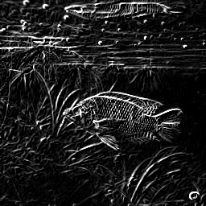
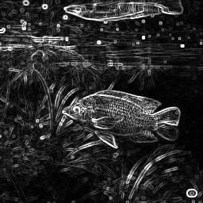
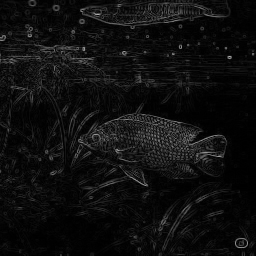
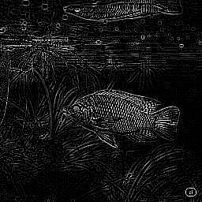

# 🖼️ Projeto de Detecção de Bordas em C com Aceleração por Hardware 🚀

## 👨‍💻 Autores

- **Davi Macêdo Gomes**: [github.com/davimg07](https://github.com/davimg07)
- **Pedro Henrique Santos Silva**: [github.com/PSSUEFS](https://github.com/PSSUEFS)

## 📜 Sumário

- [Visão Geral](#-visão-geral)
- [Estrutura do Projeto](#-estrutura-do-projeto)
- [Como Compilar](#-como-compilar)
- [Como Executar](#-como-executar)
- [Algoritmos e Teoria](#-algoritmos-e-teoria)
- [Funções da Biblioteca](#-funções-da-biblioteca)
- [Testes](#-testes)

## 🎯 Visão Geral

Este projeto consiste em uma implementação em C de algoritmos clássicos de detecção de bordas, como Sobel, Prewitt, Roberts e Laplace. A principal característica do projeto é sua arquitetura dual, que suporta a execução tanto em um processador padrão (HPS - Hard Processor System) quanto com aceleração por hardware em um FPGA (Field-Programmable Gate Array).

A operação de **convolução**, base para a maioria dos filtros de imagem e computacionalmente intensiva, é descarregada para o FPGA, resultando em um ganho de performance significativo em comparação com a execução puramente em software.

## 📁 Estrutura do Projeto

```
.
├── Makefile
├── README.md
├── bin/
├── lib/
├── media/
├── src/
└── tests/
```

- **`bin/`**: Contém os executáveis compilados.
- **`lib/`**: Inclui os arquivos de cabeçalho (`.h`).
- **`media/`**: Contém as imagens de entrada e saída.
- **`src/`**: Contém as implementações (`.c`) das funções.
- **`tests/`**: Contém os códigos de teste para os módulos.

## 🛠️ Como Compilar

A compilação do projeto é automatizada pelo `Makefile`. Para tal, executa-se o comando:

```bash
make
```

O comando gera dois executáveis no diretório `bin/`:

1.  **`bin/image_hps`**: Versão puramente em software (CPU/HPS).
2.  **`bin/image`**: Versão acelerada por hardware (FPGA), compilada com a macro `-DCOPROCESSOR`.

## ▶️ Como Executar

Após a compilação, os testes de detecção de borda podem ser executados através dos scripts do `Makefile`:

- Para a **versão em software (HPS)**:
  ```bash
  make run_hps
  ```
- Para a **versão acelerada (FPGA)**:
  ```bash
  make run
  ```

Ambos os comandos processam a imagem `media/tilapia.jpg` e salvam os resultados no diretório `media/`.

## 🧠 Algoritmos e Teoria

A detecção de bordas é uma técnica que visa identificar pontos em uma imagem onde o brilho muda drasticamente, correspondendo a limites de objetos. O método central é a **convolução 2D**, onde um **kernel** (máscara) percorre a imagem para calcular novos valores de pixel.

- **Operadores de Gradiente (1ª Derivada)**: Encontram bordas onde o gradiente da imagem é alto.
  - **Roberts Cross**: Rápido, mas sensível a ruído.
  - **Prewitt**: Usa kernels 3x3, dando igual importância aos vizinhos.
  - **Sobel**: Similar ao Prewitt, mas dá mais peso aos pixels centrais, sendo mais robusto a ruído.

- **Operador Laplaciano (2ª Derivada)**: Procura por cruzamentos por zero na segunda derivada. Bom para a localização exata das bordas, mas muito sensível a ruído.

### 🎨 Resultados Visuais

A tabela a seguir apresenta os resultados visuais para cada filtro. As imagens foram geradas utilizando a versão do software executada em HPS (`make run_hps`). A imagem de entrada original (`tilapia.jpg`) foi criada com o auxílio do modelo de IA Gemini.


| Filtro Aplicado |            Imagem Resultante         |
| :-------------: | :----------------------------------: |
| Original        |      |
| Sobel           |      |
| Prewitt         |  |
| Roberts         |  |
| Laplace         |  |


## 📚 Funções da Biblioteca

A arquitetura do projeto é dividida em três camadas principais:

1.  **Manipulação de Matrizes (`src/matrix.c`)**: O núcleo computacional, onde ocorrem as operações matemáticas, como a convolução.
2.  **Manipulação de Imagens (`src/image.c`)**: Uma camada de abstração que trata as imagens como matrizes e aplica os filtros de detecção de bordas.
3.  **Comunicação com o Coprocessador (`src/coprocessor.c`)**: Responsável por gerenciar a comunicação com o FPGA para acelerar a convolução.

---

### 1. `src/matrix.c`

Este arquivo contém a lógica de baixo nível para operações com matrizes.

- **`new_matrix` e `free_matrix`**: Funções básicas para alocação e liberação de memória para a estrutura `Matrix`.
- **`get_window`**: Extrai uma submatriz (janela) de 5x5 de uma matriz maior. Essa função é crucial para a convolução, pois prepara os dados para a aplicação do kernel. Ela também trata os casos de borda, duplicando as linhas e colunas das bordas para que o kernel possa ser aplicado em toda a imagem.
- **`hadamard`**: Realiza o produto de Hadamard, que é uma multiplicação elemento a elemento entre duas matrizes de mesmas dimensões. Na convolução, isso corresponde a multiplicar o kernel pela janela da imagem.
- **`sum`**: Soma todos os elementos de uma matriz. Usado após o produto de Hadamard para obter o valor final do pixel na imagem convolvida.
- **`convolution`**: Esta é a função mais importante. Ela implementa a operação de convolução 2D.
    - **Versão HPS (Software)**: Itera sobre cada pixel da imagem, extrai a janela correspondente, aplica o produto de Hadamard com a máscara (kernel) e soma o resultado para obter o novo valor do pixel.
    - **Versão FPGA (Hardware)**: Em vez de fazer os cálculos na CPU, ela envia a janela da imagem e a máscara para o coprocessador (`send_matrix`), dispara a operação de convolução (`conv`) e lê o resultado de volta (`get_value`). A macro `#ifdef COPROCESSOR` controla qual versão da função é compilada.
- **`generic_edge_detection`**: Uma função genérica que serve de base para os operadores de gradiente (Sobel e Prewitt). Ela calcula o gradiente horizontal e vertical aplicando a convolução com a máscara e sua transposta, e então combina os resultados usando a magnitude do gradiente.
- **`sobel`, `prewitt`, `roberts`, `laplace`**: Cada uma dessas funções define um kernel (máscara) específico e chama a função `convolution` ou `generic_edge_detection` para aplicar o filtro correspondente na matriz de entrada.

### 2. `src/image.c`

Este arquivo abstrai as operações de imagem, permitindo carregar, processar e salvar imagens facilmente.

- **`new_image`, `free_image`**: Gerenciam a alocação e liberação de memória para a estrutura `Image`, que contém tanto a versão em tons de cinza (`gray`) quanto a colorida (`colors`).
- **`get_image`**: Carrega uma imagem de um arquivo usando a biblioteca `stb_image`. Ela separa a imagem em seus canais de cor e também cria uma versão em tons de cinza.
- **`save_image`**: Salva uma imagem em um arquivo usando `stb_image_write`. Pode salvar a imagem em tons de cinza ou colorida.
- **`edge_detection_generic_image`**: Uma função auxiliar estática que aplica uma função de callback (um dos filtros de `matrix.c`) à matriz de tons de cinza de uma imagem.
- **`sobel_image`, `prewitt_image`, etc.**: Funções de alto nível que recebem uma estrutura `Image` e aplicam o filtro de detecção de bordas correspondente, retornando uma nova `Image` com o resultado.

### 3. `src/coprocessor.c`

Este arquivo lida com a comunicação de baixo nível com o coprocessador em FPGA através de mapeamento de memória (`/dev/mem`).

- **`init_mpu` e `cleanup_mpu`**: Inicializam e finalizam a comunicação com o FPGA. `init_mpu` mapeia os endereços de memória física da ponte Leve (Lightweight HPS-to-FPGA Bridge) para o espaço de endereçamento virtual do processo, permitindo que o software acesse os registradores do hardware.
- **`store` e `load`**: Funções para escrever e ler dados dos registradores do coprocessador. A comunicação é feita através de um protocolo simples de handshake, onde o software espera por um bit de "pronto" (`done`) do hardware.
- **`send_matrix`**: Envia uma matriz 5x5 (seja a janela da imagem ou o kernel) para os registradores do coprocessador, um elemento de cada vez.
- **`conv`**: Envia um comando para o coprocessador para iniciar a operação de convolução no hardware.
- **`get_value`**: Lê o valor resultante da convolução do coprocessador.

## ✅ Testes

### `tests/matrix.c`

Contém testes unitários para a lógica de matrizes. Cada filtro e operação possui um teste dedicado.

### `tests/image.c`

Contém testes de integração em imagens reais.

- **`test_image`**: Testa o fluxo de carga, manipulação e salvamento.
- **`test_edge_detection_image`**: Aplica todos os filtros e salva os resultados para verificação visual.
